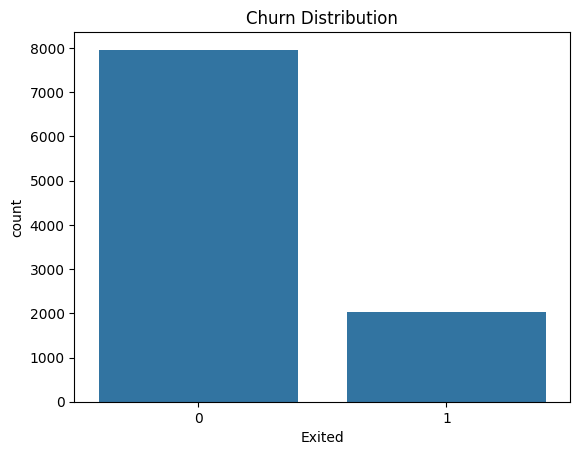
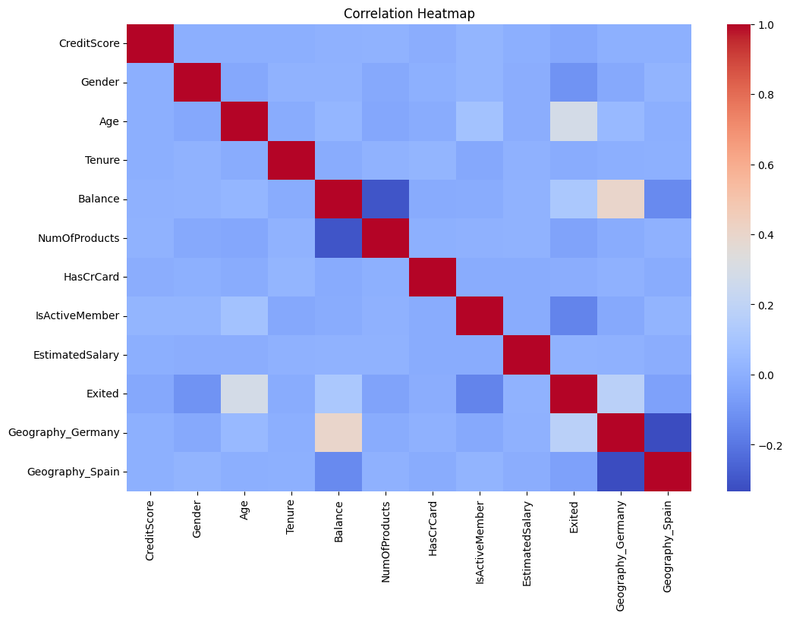
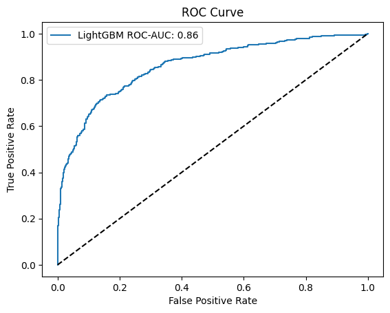
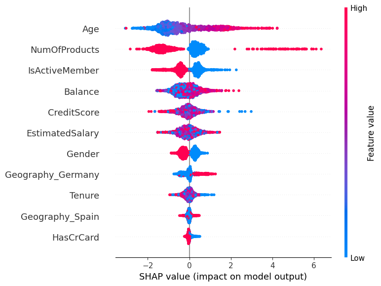

# Customer Churn Prediction

## 📌 Project Objective
The main objective of this project is to build a machine learning model to predict customer churn in a bank. Identifying customers who are likely to leave the bank allows for better strategic decisions, improved retention, and targeted marketing campaigns.

Key goals:
- Analyze customer data to uncover churn patterns.
- Build, tune, and evaluate multiple classification models.
- Interpret model results using SHAP values and feature importance.
- Provide actionable insights for business improvement.

---

## 🗂️ Repository Structure

```
├── data
│   └── Churn_Modelling.csv           # Dataset used
├── images
│   ├── churn_distribution.png      # Churn distribution visualization
│   ├── correlation_heatmap.png     # Feature correlation heatmap
│   ├── roc_logistic.png            # ROC curve - Logistic Regression
│   ├── roc_random_forest.png       # ROC curve - Random Forest
│   ├── roc_xgboost.png             # ROC curve - XGBoost
│   ├── roc_lightgbm.png            # ROC curve - LightGBM
│   └── shap_summary.png            # SHAP feature importance plot
├── notebooks
│   └── Customer_Churn_Prediction.ipynb   # Jupyter notebook with code
├── README.md
└── requirements.txt
```

---

## 🚀 Steps to Run the Project

### 1️⃣ Clone the Repository

```bash
git clone [https://github.com/yourusername/Customer-Churn-Prediction.git](https://github.com/SaiBhujbal/Customer-Churn-Prediction.git)
cd Customer-Churn-Prediction
```

### 2️⃣ Create a Virtual Environment (Optional but Recommended)

```bash
python -m venv venv
source venv/bin/activate  # For Linux/macOS
venv\Scripts\activate     # For Windows
```

### 3️⃣ Install Required Dependencies

```bash
pip install -r requirements.txt
```

### 4️⃣ Run the Notebook

Open the Jupyter Notebook:

```bash
jupyter notebook
```

Navigate to:

`notebooks/Customer_Churn_Prediction.ipynb`

Run all cells step by step.

---

## 📝 Model Building & Evaluation

We experimented with various machine learning models:
- Logistic Regression
- Random Forest
- XGBoost
- LightGBM

**Evaluation Metrics:**
- Accuracy
- ROC-AUC Score
- Precision, Recall, F1-Score
- Confusion Matrix

### ✅ Best Performing Model:
**LightGBM Classifier**  
- ROC-AUC Score: **0.86**

---

## 📊 Visualizations & Insights

### 1️⃣ Churn Distribution

  
Shows imbalance in data — majority of customers did not churn.

---

### 2️⃣ Correlation Heatmap

  
Reveals correlations between numerical features like CreditScore, Balance, and Churn.

---

### 3️⃣ ROC Curves

| Model                | ROC-AUC Score |
|---------------------|--------------|
| Logistic Regression | 0.77         |
| Random Forest       | 0.85         |
| XGBoost             | 0.83         |
| **LightGBM**        | **0.86**     |

**Sample ROC Curve:**



---

### 4️⃣ SHAP Feature Importance



Key influential features:
- **Age**
- **Number of Products**
- **IsActiveMember**
- **Balance**
- **Credit Score**

---

## 📈 Business Implications
- Customers with high balance and lower age tend to churn more.
- Active members and those with fewer products are less likely to churn.
- Helps marketing & retention teams prioritize customers.

---

## 💡 Technologies Used
- Python (Pandas, NumPy, Scikit-learn, XGBoost, LightGBM)
- SHAP for model interpretability
- Matplotlib & Seaborn for visualization
- Jupyter Notebook

---

## 🏆 Evaluation Criteria:
- ✅ **Functionality**: Clean, modular, well-documented code. Runs end-to-end.
- ✅ **Interpretability**: SHAP and visualizations explain model decisions.
- ✅ **Structure**: Clear repository organization.

---

## 📈 Results Summary

| Model               | Accuracy | Highlights                          |
|--------------------|---------|------------------------------------|
| Logistic Regression | 80.8%   | Baseline, lower recall for churn   |
| Random Forest       | 86.1%   | Strong precision/recall balance    |
| XGBoost             | 85.3%   | Excellent accuracy & explainability|
| LightGBM            | 86.2%   | High accuracy, fast training       |

---


---

## 📥 Dataset Source
[Bank Customer Churn Dataset](https://www.kaggle.com/datasets/adammaus/predicting-churn-for-bank-customers)

---

## 📌 Conclusion
This project demonstrates a complete pipeline from EDA to advanced model tuning and interpretation, providing actionable insights to reduce churn.

---
